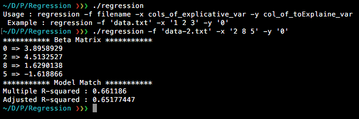

# linear-regression
A Haskell script for multiple (and simple) linear regression base on R output. The aim is to compute the estimated Beta matrix and display the R-Squared and Adjusted R-Squared.




## Compile

In order to compile the ```regression.hs``` file, just run the following line

```bash
$ ghc regression.hs
```
(Too easy)

## Usage
To use the script just run

```bash
$ ./regression -f filename -x cols_of_explicative_var -y col_of_toExplain_var
```

Where :
- ```cols_of_explicative_var``` (string) index of the columns which are explicatives (*for instance -> "2 8 5"*)
- ```col_of_toExplain_var``` (string) index of the column we want to explain (*for instance -> "0")*
- ```filename```(string) the file name 👍

### Example

If you want to test the script, some data is provide in the Data folder. For a multiple model, just run :

```bash
$ ./regression -f 'data-2.txt' -x '2 8 5' -y '0'
```

### Output

After running this command (or another) you will have an output like

```
*********** Beta Matrix ***********
0 => 3.8958929
2 => 4.5132527
8 => 1.6290138
5 => -1.618866
*********** Model Match ***********
Multiple R-squared : 0.661186
Adjusted R-squared : 0.65177447
```

Where 0,2,8,5 correspond to intercept, variable at column 2, variable at column 8 and variable at column 5 from your file.

## File format

No header allowed ... Data should be separated by a blank, and digital number written with a "." not a ",". For example we could have :

```
87 15.6 18.5 18.4 4 4 8 0.6946 -1.7101 -0.6946 84 "Nord" "Sec"
82 17 18.4 17.7 5 5 7 -4.3301 -4 -3 87 "Nord" "Sec"
92 15.3 17.6 19.5 2 5 4 2.9544 1.8794 0.5209 82 "Est" "Sec"
```
